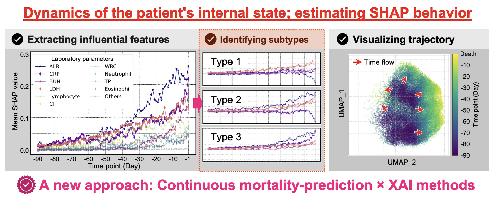
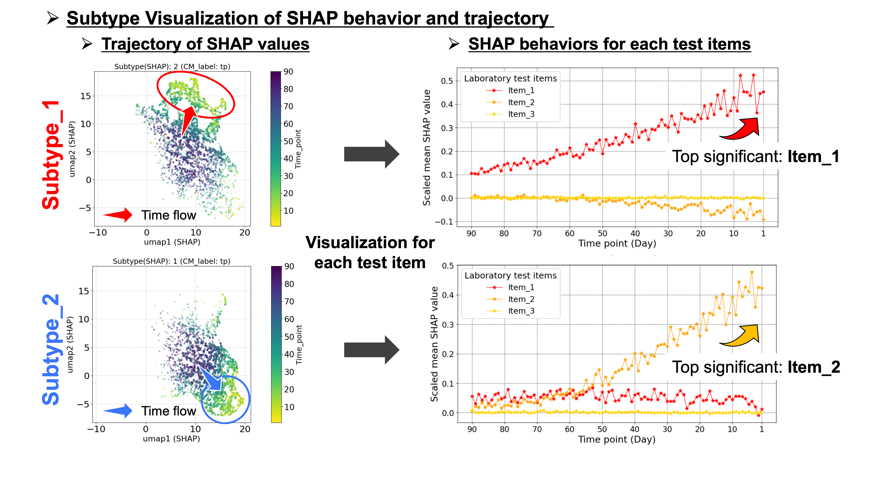

# What Happens to Cancer Patients before They Die? Extracting the Dynamics of Mortality Factors using Continuous Mortality-Prediction and SHAP Behaviors
**Authors:** Tatsuki Yamamoto, Minoru Sakuragi, Yuzuha Tuji, Yuji Okamoto, Eiichiro Uchino, Motoko Yanagita, Mayumi Kamada, and Yasushi Okuno

---
## Contents
- [General Description](#general-description)
- [Requirements](#requirements)
- [Directory Structure](#directory-structure)
- [Usage](#usage)
    1. [Dummy EHR-data negeration](#ⅰ-dummy-ehr-data-generation)
    1. [Mortality prediction model construction](#ⅱ-mortality-prediction-model-construction)
    1. [SHAP value calculation](#ⅲ-shap-value-calculation)
    1. [Data integration](#ⅳ-data-integration)
    1. [SHAP behavior estimation for each item](#ⅴ-shap-behavior-estimation-for-each-laboratory-test-item)
    1. [Visualize trajectory of SHAP behavior using UMAP](#ⅵ-visualize-trajectory-of-shap-behavior-using-umap)
    1. [Subtype classification](#ⅶ-subtype-classification)
    1. [Subtype visualization of SHAP behavior and trajectory](#ⅷ-subtype-visualization-of-shap-behavior-and-trajectory)
- [Contact](#contact)
- [Reference](#reference)
 
---


## General Description
This repository provides resources to reproduce the analysis flow introduced in the body of our manuscript. We applied mortality prediction models and its interpretation method (SHAP: SHapley Additive exPlanations) continuously over time to evaluate outcomes in cancer patients. This allowed us to estimate the temporal impact transitions of factors (which we call "SHAP behavior") that worsen the internal state of cancer patients and are directly related to future mortality.

You can implement our proposed method using time-series EHR data that has undergone data curation and resampling processes as described in the manuscript. You can utilize the dummy data generation process included in the provided codes to implement our proposed framework. The original data used in our study is not publicly available due to privacy concerns.

Again, this framework involves continuous mortality-prediction models and the SHAP framework, which allows us to estimate the temporal behavior of factors on outcomes, on a per-sample basis.

See our [manuscript](URL) for details.



## Requirements

- Python==3.9
- LightGBM==3.0.0
- shap==0.46.0
- optuna==2.0.0
- scikit-learn
- scipy
- umap-learn
- numpy 
- pandas
- math
- random
- matplotlib
- seaborn
- pickle
- tqdm

## Directory Structure

```
.
├── code           : Jupyter notebook files
├── data           : Directory for dummy dataset and sample output files       
├── figure         : Figures for README.md
├── LICENSE        : License file
└── README.md      : This file
```

## Usage

### Setup

#### Running on Google colab

All notebook files provided in the `./code` directory are intended to run on Google colaboratory. In this case, you can reproduce our flow by executing the provided codes in order.

**Before execution, please build the following directory under `content/drive/MyDrive` in Google drive.**

```
shap_behavior_estimate
├── models
├── roc_curves
├── auroc
├── shap_values
   ├── shap_values_tp
   ├── shap_values_tn
   ├── shap_values_fp
   ├── shap_values_fn
├── test_values
   ├── test_values_tp
   ├── test_values_tn
   ├── test_values_fp
   ├── test_values_fn
└── shap_test_values
```

#### Running on other environments

You can also run the code in an environment other than Google colaboratory. If you duplicate this repository and run the code, you can reproduce the flow from any step by using the sample files included by default in the `./data` directory. **Note that you will need to change the paths to all input and output files included in the notebook.**

### Analysis steps

**1. Dummy EHR-data Generation** [](https://colab.research.google.com/drive/1Q8Rd4JX9HuUrYCLRUixdJihipanudtrt#scrollTo=BDHlDyLP5Dko)


### ⅰ. Dummy EHR-data Generation

In the code `s1_dummy_data_generation.ipynb`, we can generate dummy time-series EHR data. A Gaussian Mixture Model (GMM) is applied to create a dataset consisting of two patient groups that show clearly distinct changes in internal patinet states.

**Detail of dummy data is as follows:** 
- It consists of five columns: three test item names (`Item_1`, `Item_2`, `Item_3`), `Patient_ID`, and `Time_point`. Here, the *time point* represents the time from the day of death. For example, if the value of `Time_point` is 1, it means that the is the test data from one day before death.
- It includes 200 patients. For each patient, the dataset contains test data for 91 time points, covering the 90 days prior to death and 168 negative days
- It is suppose to be after resampling as shown in the [manuscript](URL). Such data without missing data is ideal, and it is assumed that the majority of the actual data will be missing.

The code provides a `visualize_dummy_distribution` function that displays a scatter plot with the distribution of data points at several time points, color-coded by that two patient group. By running this function, you can realize how the distributions of the two patient groups diverge as the time point approaches death. 

What is more, this transition is effectively depicted by our proposed framework!

#### Input and Output

- **Input**: No input data.
- **Output**:
    - `dummy_time_series_EHRdata.csv`: Dummy time-series EHR data. Saved in the `/data` directory.

#### Contents of the Output Dummy EHR-Data

- **Shape**: 18200 rows × 5 columns
- **Rows**: Records of test values for each time point of each patient
- **Columns**: Laboratory test items × 3, Patient_ID, and Time_point


---

### ⅱ. Mortality Prediction Model Construction

In the code `2_prediction_model_construction.ipynb`, we construct LightGBM-based mortality prediction models using time-series EHR data. The model we refer to as the *n-day model* predicts mortality n days later. Here, *n* represents any time point closer to death than the negative time point (in our [manuscript](URL), we set the negative time point to 168 days, and *n* ranges from 1 to 90).

#### Overview of this Code

- **Labeling the training dataset from time-series EHR data**: Data from *n* days before death is labeled as positive, and data from 168 days before death is labeled as negative.
- **Constructing the LightGBM-based mortality prediction model**: Model construction and evaluation are performed using 5-fold cross-validation. After the optimal hyperparameters are searched using Optuna's `LightGBMTunerCV`, training and evaluation are conducted.
- **Outputting data**: Prediction models, ROC curves, and AUROC for each fold of the cross-validation are saved.

#### Input and Output

- **Input**: Automatically loaded.
    - `dummy_time_series_EHRdata.csv`: Time-series EHR data (see step.ⅰ).
- **Output**:
    - `mpmodel_tp_[time_point]_cv_[cv_index].pkl`: Mortality prediction model. Saved in `/data/model`. The `time_point` indicates the prediction time point, and the `cv_index` indicates the index of the 5-fold CV.
    - `roc_curve_tp_[time_point]_cv_[cv_index].png`: ROC curve. Saved in `/data/roc_curve`.
    - `auroc_tp_[time_point].csv`: AUROC values. Saved in `/data/auroc`. This file includes AUROC values for each fold and the mean and SD.


---

### ⅲ. SHAP Value Calculation

In the code `2_SHAP_value_calculation.ipynb`, we applies SHAP to the constructed mortality prediction models for each time point to calculate SHAP values from laboratory test values. Data is aggregated and saved for each of the four components of the confusion matrix: TP, FN, FP, and TN. By setting `shap_summary_plot==True` in the `shap_value_calculation_main` function, SHAP summary plots can be displayed.

#### Input and Output

- **Input**: Automatically loaded.
    - `dummy_time_series_EHRdata.csv`: Time-series EHR data (see step.ⅱ).
    - `mpmodel_tp_**time_point**_cv_**cv_index**.pkl`: Mortality prediction model (see step.ⅱ).
- **Output**:
    - `shap_values_[cm_label]_tp_[time_point].pkl`: SHAP values. Saved in `data/shap_values/shap_values_[cm_label]`. `[cm_label]` indicates TP, FN, FP, or TN.
    - `test_values_[cm_label]_tp_[time_point].pkl`: Laboratory test values. Saved in `data/test_values/test_values_[cm_label]`.

#### Contents of the Output SHAP Values or Test Values Data

- **Shape**: *sample_num* rows × 4 columns
- **Rows**: The number of patient samples classified into each confusion matrix component
- **Columns**: SHAP/Laboratory test values of each item × 3, Patient_ID
  


---

### ⅳ. Data Integration

In the code `3_Data_join.ipynb`, we integrate the previously calculated SHAP values with the corresponding laboratory test data. It also performs scaling on the SHAP values using their maximum values.

#### Input and Output

- **Input**: Automatically loaded.
    - `shap_values_[cm_label]_tp_[time_point].pkl`: SHAP values for each time point (see step.ⅲ).
    - `test_values_[cm_label]_tp_[time_point].pkl`: Test values for each time point (see step.ⅲ).
- **Output**:
    - `shap_test_values_[cm_label].pkl`: Integrated data of SHAP values and test values. Saved in `data/shap_test_values`.
    - `shap_test_values_norm_[cm_label].pkl`: Integrated data of scaled SHAP values and test values. Saved in `data/shap_test_values`.

#### Details of the Output Data (SHAP/Test values)

- **Shape**: *sample_num* rows × 5 columns
- **Rows**: Each SHAP/laboratory test value record
- **Columns**: Patient_ID, Test_item (i.e., test item name), Test_value, SHAP_value, Time_point


---

### ⅴ. SHAP Behavior Estimation for Each Laboratory Test Item

In the code `4_SHAP_behavior_visualization.ipynb`, we visualizes the SHAP behavior of each laboratory test item from the integrated data processed in step.ⅳ.

#### Input and Output

- **Input**: Automatically loaded.
    - `shap_test_values_norm_[cm_label].pkl`: Integrated data with scaled SHAP values (see step.ⅳ).
- **Output**: No output data.

#### Visualization Functions

This code includes the following two visualization functions. The input data is automatically loaded within these functions.

- `Visualize_shap_behavior`: Visualizes the SHAP behavior of each test item, displaying all in one plot.
- `Visualize_distribution`: Visualizes the temporal distribution transition of SHAP or test values for each test item.
    - `val_type` can be set to either `SHAP_value` or `Test_value`.
    - `round` can be used to group multiple time points for display. i.e. Setting it to 1 will display the distribution at each time point.

Both functions allow the following arguments to be set:
- `cm_label`: Specifies the confusion matrix component (TP, FN, FP, or TN) to visualize.
- `figsize`: Adjusts the size of the figure.
- `fontsize`: Adjusts the size of the text.

**Note**: If you are using data other than the default generated dummy data, please modify the `dict_color` defined within each function to specify the color for each test item.


---

### ⅵ. Visualize Trajectory of SHAP Behavior Using UMAP

In the code `5_Visualize_SHAP_behavior_via_UMAP.ipynb`, we uses UMAP to perform dimensionality reduction on the data of laboratory test values and corresponding SHAP values, visualizing the trajectory of SHAP behavior as a 2D plot.

#### Overview of this Code

- **Dataset Preparation for UMAP Analysis**: Unlike the integrated dataset created in step.ⅳ (`3_Data_join.ipynb`), this prepared dataset includes SHAP values and their corresponding test values in the same record. Test values are standardized.
- **Dimensionality Reduction with UMAP**: SHAP values and test values processed with UMAP separately, extracting the first and second principal components.
- **Visualization of SHAP Behavior**: The results of UMAP-based dimensionality reduction are visualized.

#### Input and Output

- **Input**: Automatically loaded and integrated.
    - `shap_values_[cm_label]_tp_[time_point].pkl`: SHAP value data for each time point (see step.ⅲ).
    - `test_values_[cm_label]_tp_[time_point].pkl`: Laboratory test value data for each time point (see step.ⅲ).
- **Output**:
    - `shap_test_values_all_before_UMAP.pkl`: Integrated data for UMAP analysis. Saved in `data/shap_test_values`.
    - `shap_test_values_all_before_UMAP_standardized.pkl`: Standardized data for UMAP analysis. Saved in `data/shap_test_values`. Test values are standardized.
    - `shap_test_values_all_after_UMAP_standardized.pkl`: Standardized data with the first and second UMAP principal components added. Saved in `data/shap_test_values`.

#### Columns in the Output Data

- `Time_point`
- `Cm_label`: Components of the confusion matrix. One of TP, FN, FP, TN.
- `Patient_ID`
- `Item_x_shap`: SHAP value of test item X
- `Item_x_test`: Test value of test item X

In the data `hap_test_values_all_after_UMAP_standardized.pkl`, the following columns are added after the `Patient_ID` column:
- `SHAP_umap_i`: i-th principal component of SHAP values (i=1,2)
- `Test_umap_i`: i-th principal component of laboratory test values (i=1,2)

#### Visualization of SHAP Behavior

SHAP behavior is visualized using the `Visualize_SHAP_behavior_via_UMAP` function. The following arguments can be specified:
- `val_type`: Specifies the type of principal component to visualize. For example, selecting `SHAP_value` will display a 2D plot of the dimensionality reduction using SHAP values.
- `cm_label`: Specifies the component of the confusion matrix (TP, FN, FP, or TN) to visualize.


---

### ⅶ. Subtype Classification

In the code `6_Subtype_classification`, we classifies patient state subtypes using the SHAP value patterns or laboratory test value patterns for each patient at one day before death.

#### Input and Output

- **Input**: Automatically loaded.
    - `shap_test_values_all_after_UMAP_standardized.pkl`: (see step.ⅵ)
- **Output**:
    - `patient_id_subtype_label.pkl`: Subtype data for each patient, including subtype labels based SHAP values and test values. Saved in `data/shap_test_values`.
    - `shap_test_values_all_after_UMAP_standardized_subtyped.pkl`: The UMAP analysis data with subtype labels added. Saved in `data/shap_test_values`.

#### Workflow

First, execute the `Subtype_classification_main` function to display the dendrogram. Then, set `threshold_shap` and `threshold_testval` to appropriate values in order to classify into two classes.

**Note**: The dummy data is noise-free and has extremely simple trends in the test values, resulting in highly accurate clustering results with test values. However, since real-world data contains noise and consists of high-dimensional features, clustering using laboratory test values is inferior to clustering using SHAP values in its ability to identify patient states subtypes. Please review the [manuscript](URL) for more details.


---

### ⅷ. Subtype Visualization of SHAP Behavior and Trajectory

In the code `7_SHAP_behavior_and_UMAP_for_subtype.ipynb`, we visualizes the SHAP behavior and UMAP-based trajectory for each patient state subtype.

#### Input and Output

- **Input**: Automatically loaded.
    - `shap_test_values_norm_[cm_label].pkl`: (see step.ⅳ)
    - `patient_id_subtype_label.pkl`: (see step.ⅶ)
    - `shap_test_values_all_after_UMAP_standardized_subtyped.pkl`: (see step.ⅶ)
- **Output**: No output data.

#### Visualization Functions

This code includes the following three visualization functions. Input data is automatically loaded within these functions.

- `Visualize_shap_behavior_via_UMAP`: Visualizes trajectory in 2D plot using UMAP.
- `Visualize_shap_behavior`: Visualizes SHAP behavior of each test item, displaying all in a single transition plot.
- `Visualize_distribution`: Visualizes the temporal distribution of SHAP or test values for each test item.
    - The `val_type` argument can be set to either SHAP or Test (SHAP_value or Test_value for `Visualize_distribution`).
    - The `round` argument can be used to display multiple time points together. Setting it to 1 displays the distribution at each time point.

All functions allow the following arguments to be adjusted:
- `subtype`: Specifies the patient state subtype to visualize.
- `cm_label`: Specifies the confusion matrix component (TP, FN, FP, or TN) to visualize.
- `figsize`: Adjusts the size of the figure.
- `fontsize`: Adjusts the size of the text.

**Note**: If you are using data other than the default generated dummy data, modify the `dict_color` defined within each function to specify colors for each test item.



---

# Contact
- Tatsuki Yamamoto: yamamoto.tatsuki.25d@[at].kyoto-u.ac.jp

# Reference
bioRxiv
```
@article{---,
  title={---},
  author={---},
  journal={---},
  pages={---},
  year={---},
  publisher={---}
}
```
  


